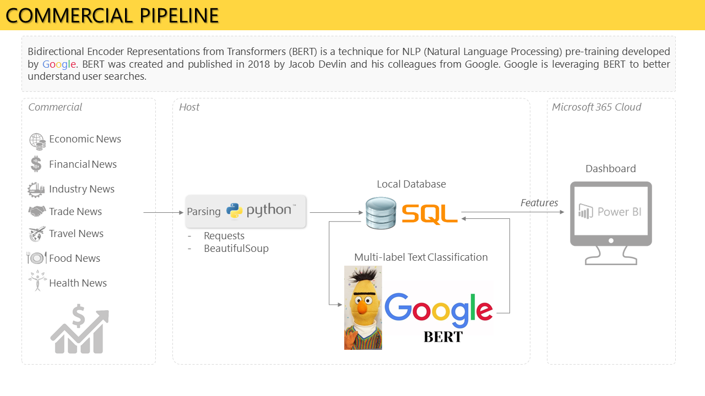

# Information-field-monitoring
## Parsing news from russian mass media and it content analysis

<b>Summary. In conditions of excessive information flow, it is extremely difficult to compose an objective picture of what is happening exactly as if there was no information at all.
To assess the objective dynamics of the changes taking place in the information field, it is necessary to squeeze out features from the news flow and reduce it.</b>

<b>TARGET STAGE 1</b> - build a system of multiclass classification of news reflecting the dynamics of changes in the information field in Russia

<b>To achieve the goal of the project it is necessary</b>:
- create a module for parsing news feeds of the most popular news agencies in the country;
- develop and deploy a database for storing news texts;
- mark the test data set as many data classes, such as negative or positive news, type of news, news topic, etc.;
- configure a neural network with the pre-trained linguistic module BERT;
- train the neural network on a test data set;
- test the effectiveness of the neural network on new unlabeled data;
- design the information panel Power BI to visualize the result of the classifier;
- upload data to the report and deploy it on the local server / in the cloud

<b>The repository contains the following blocks of program code</b>:
- common_parser - module for parsing all the required news;
- SCHEMA - structure and configuration of a relational database for storing project data;
- push_news_todb.py - module for saving texts of news in the local project database (see SCHEMA);
- train.csv - labled data set for neural network training;
- NN.py - neural network;
- dashboard.pbix - visualized of the result of the NN classifier

<b>TARGET STAGE 2</b> - creation of an analytical platform that meets the needs of various businesses in the analysis of their information field

<b>Any business exists in conditions of uncertainty. Changes in legislation, consumer preferences, geopolitical environment, etc., have a significant impact on business. With the development of mass communications, a particular impact on the business is provided by the information environment specific to each individual business.</b>
